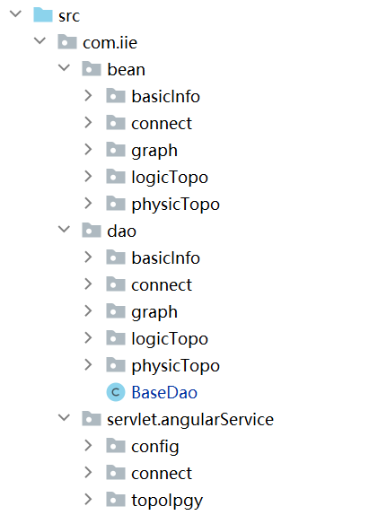

## 数据库学习
#### 本次项目中使用的数据库为MySQL 本次项目为netTopo  
> 数据库配置
>> 本次项目采用Tomcat服务器，前后端不分离  
> 
> 项目结构  

  
由图中可以看到 采用的为SMV架构 其中dao是专门进行数据库处理的 为每个表划分单个类进行数据库处理  
首先是数据库的基本配置(采用JDBC连接)
```J
    Connection connection = null;
    String driver = "com.mysql.jdbc.Driver";
    String url = "jdbc:mysql://localhost:3306/switch_info?useUnicode=true&characterEncoding=UTF-8&userSSL=false&serverTimezone=GMT%2B8&useOldAliasMetadataBehavior=true";
    String username = "root";
    String password = "password";
```
数据库的查询(根据IP查找其他字段内容)
```J
    public List<FibInfo> queryInfoByIp(String ip){
        List<FibInfo> result=new ArrayList<>();
        Connection conn =  getConnection();
        try {
            PreparedStatement stmt = (PreparedStatement) conn.prepareStatement
                    ("SELECT name,mask,port FROM fib_table where ip = ?;");
            stmt.setString(1, ip);
            ResultSet rs =  stmt.executeQuery();
            while(rs.next()) {
                String name=rs.getString("name");
                String mask=rs.getString("mask");
                String port = rs.getString("port");
                result.add(new FibInfo(name,ip,mask,port));
            }
            stmt.close();
            conn.close();
        } catch (SQLException e) {
            e.printStackTrace();
        }
        return result;
    }
```
数据库的增加
```J
    public int addInfoList(List<FibInfo> fibTable){
        Connection conn = getConnection();
        PreparedStatement stmt= null;
        String sql = "insert into fib_table ( name,ip,mask,port) values(?,?,?,?)";
        for(FibInfo fibInfo:fibTable){
            try {
                stmt = (PreparedStatement) conn.prepareStatement(sql);
                stmt.setString(1,fibInfo.getName());
                stmt.setString(2,fibInfo.getIp());
                stmt.setString(3,fibInfo.getMask());
                stmt.setString(4,fibInfo.getPort());
                stmt.executeUpdate();
            } catch (SQLException e) {
                e.printStackTrace();
                return -1;
            }
        }
        try {
            if(stmt!=null)
                stmt.close();
            conn.close();
        } catch (SQLException e) {
            e.printStackTrace();
            return -1;
        }
        return 0;
    }
```
数据库的删除操作
```J
    public boolean delInfo(String ip){
        String sql="delete from fib_table where ip='" + ip + "'";
        return this.execute(sql);
    }

    public void deleteAllInfo(){
        String sql="truncate table fib_table";
        this.executedelete(sql);
    }
```
> 注意这两种方式，前者是删除fib_table，后者是清空fib_table的内容  

当使用多线程访问数据库时，可能会产生报错，具体原因是当一个con未释放，新的con就被申请
> 方法：给调用数据库的方法加锁synchronized  如下：

```J
    synchronized public static List<Vlanport> getVlanPorts(String switchIp, String routeTableEcho)  {
        List<Vlanport> vlanRes = new ArrayList<>();
        String[] lines = routeTableEcho.split("\n|\r\n|\r");
        SqlTest h = new SqlTest();
        con = h.getConnection();
        String device  = h.queryData("topo_node",switchIp,"ip","name");
```